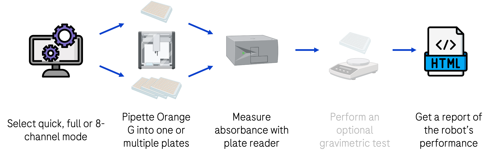

# Pipetting Performance Workflow (Roche pRED project)
This repository contains the source code for the pipetting performance workflow developed for the I2S and ADME chapters at Roche pRED. The presented workflow provides precise and intuitive approach for testing the pipetting accuracy and precision of automated liquid handling systems. It was adapted for public use to work through a Jupyter notebook instead of the proprietary AutoLab platform used internally at Roche.



***Figure 1:** Pipetting performance workflow steps. The gravimetric test was not implemented in the standalone version of the workflow which is provided here.*

## Project overview
Three distinct run options are provided to suit different scenarios and time constraints. Please refer to the following table when deciding on which one to choose. Use one of the linked notebooks depending on your choice:

| Quick run                | Full run                        | 8-channel run                 |
|:------------------------:|:-------------------------------:|:-----------------------------:|
| 96- or 384-channel heads | 96- or 384-channel heads        | 8- or single-channel heads    |
| Uses **1 microplate**    | Uses at least **3 microplates** | Uses **1 microplate**         |
| Takes **20-30 minutes**  | Takes **~45 minutes**           | Takes **20-30 minutes**       |
| Quick performance check  | Thorough statistical analysis   | Thorough statistical analysis |
| <a href="pipetting_performance_quick.ipynb">`pipetting_performance_quick`</a> | <a href="pipetting_performance_full.ipynb">`pipetting_performance_full`</a> | <a href="pipetting_performance_8channel.ipynb">`pipetting_performance_8channel`</a> |

***Table 1:** Comparison of different run mode options. Run one of them by selecting one of the linked notebooks.*

## Repository structure
### <a href="templates">`templates`</a> &nbsp; Collection of templates for using the workflow
Contains reader and pipetting robot scripts, as well as Excel templates for pasting data from unsupported readers. A `README.md` file with more information is included. This should be your first stop when trying to implement the workflow for your system.

### <a href="code">`code`</a> &nbsp; Functions accessed by notebooks
Contains the scripts accessed by the notebooks for running the pipetting performance workflow. These are altered version of the ones found in the <a href="transformations">`transformations`</a> directory. They were slightly modified to work in combination with the Jupyter notebooks.

### <a href="data">`data`</a> &nbsp; Example input data
Contains example input files with actual data that can be used to test the code. The processed files are saved in the <a href="data/processed">`processed`</a> subdirectory. The processed files from the examples used can already be found there.

### <a href="output">`output`</a> &nbsp; Example output HTML reports
Contains example HTML reports generated using the provided input files. They can be recreated by running the notebooks with the provided input files. Additionally, an image of the BPMN workflow is included here as well.

### <a href="transformations">`transformations`</a> &nbsp; Code produced at Roche
Contains the Python scripts as written during the internship with some of the internal data removed. In addition, the Camunda BPMN is also accessible here, which was used to run the Python scripts through AutoLab.


***Figure 2:** Pipetting performance BPMN workflow modeled in Camunda Modeler. The AutoLab integration was configured with this BPMN.*

## Dependencies
This project requires the following Python libraries:
`numpy`
`pandas`
`matplotlib`
`scipy`

They can be installed using PIP:
```bash
pip install numpy pandas matplotlib scipy
```

## Installation
Re-running the code in the notebooks requires an installation of Python 3 and the libraries mentioned above. Aside from the scripts found in the `code` directory, no external files are needed.

## Usage
As long as the dependencies are present, the notebooks should run without a problem. You can clone the repository to make sure all files are in the right place. The notebooks are self-explanatory and guide you through performing the assay yourself. You just need to specify your experimental parameters and the paths to your reader files. The <a href="templates">`templates`</a> directory contains a `README.md` file detailing the usage of the contained files and templates as well as additional information about the project.

## Contributing
If you want to contribute to this project, found any bugs or have new feature ideas, please open an issue!

## License
This project is licensed under the **GNU General Public License v3.0**, allowing you to freely use, modify, and distribute the code. Any derived works must also be licensed under GPL-3.0, promoting open-source collaboration and transparency. Please review the license terms before using or contributing to this project.
